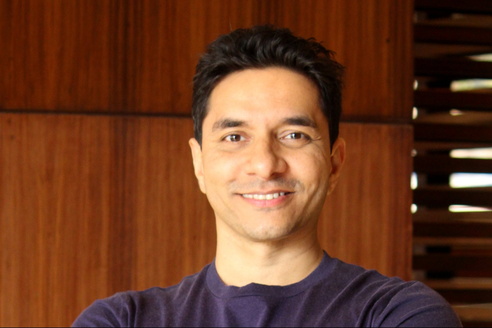

In today’s fast-paced and hectic world, wellness and happiness are more essential than ever. The constant demands of work, family, and digital overload often leave us drained—physically, emotionally, and mentally. Wellness is not just the absence of illness; it’s a holistic state of balance that includes good nutrition, regular movement, quality sleep, emotional resilience, and a sense of purpose. When we invest in our well-being, we experience improved focus, energy, and inner peace, which allows us to show up better—not just for ourselves, but also for our families, friends, and communities.

Happiness, too, is a byproduct of wellness. It stems from inner alignment, healthy habits, and meaningful connections rather than external success alone. In nurturing our wellness, we create space for joy, gratitude, and contentment to grow.

Choosing wellness is a powerful act of self-love and responsibility. It’s a message to ourselves and our loved ones that we value life, health, and the people we care about. By prioritizing self-care, mindful living, and emotional health, we become role models of balanced living. Let your journey toward wellness and happiness inspire those around you. When one person heals and grows, it uplifts others too—because true well-being is beautifully contagious.

Continuing on the journey of wellness and happiness, I am deeply grateful to have found guidance and inspiration through two incredible wellness gurus—[**Saurab Bothra**](/bites/my-wellness-guru-saurab-bothra/) and [**Luke Coutinho**](/bites/my-wellness-guru-luke-coutinho/).

**Saurab Bothra** is a mindfulness coach and breathwork expert whose teachings emphasize the transformative power of awareness, breath, and inner stillness. His approach brings clarity and calm amidst life’s chaos, helping people reconnect with themselves and navigate stress with grace. His techniques have empowered me to be more present, grounded, and emotionally resilient.

**Luke Coutinho**, on the other hand, brings a holistic vision of health that integrates nutrition, lifestyle, emotional well-being, and spiritual growth. His philosophy that “lifestyle is the best medicine” has reshaped my perspective on health. Through his practical, compassionate, and deeply personalized approach, I’ve learned to align my daily habits with my long-term well-being.

Together, Saurab and Luke represent a balanced blend of inner and outer healing. Their guidance continues to transform my life, reminding me that investing in wellness is not a luxury—it’s a necessity. I hope their wisdom inspires others as it has inspired me, to prioritize self-care, live mindfully, and create a life rooted in health, joy, and meaning.
