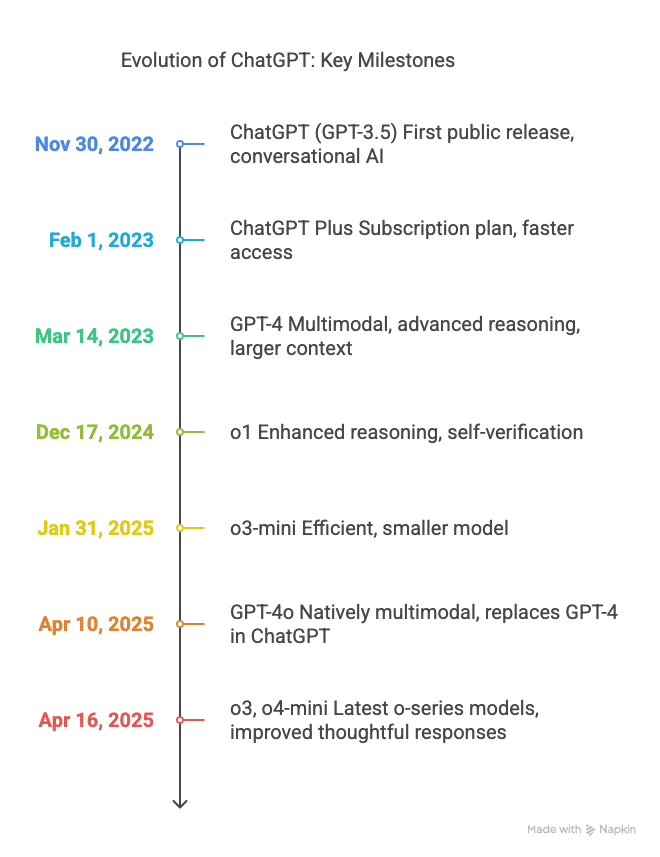

Below is a comprehensive timeline of all significant versions and models released by OpenAI for ChatGPT, including key milestones and feature introductions.

### **Summary Table: Major ChatGPT Model Releases**

| **Release Date** | **Model/Version** | **Key Advancement/Change**                            |
| ---------------- | ----------------- | ----------------------------------------------------- |
| Nov 30, 2022     | ChatGPT (GPT-3.5) | First public release, conversational AI               |
| Feb 1, 2023      | ChatGPT Plus      | Subscription plan, faster access                      |
| Mar 14, 2023     | GPT-4             | Multimodal, advanced reasoning, larger context        |
| Dec 17, 2024     | o1                | Enhanced reasoning, self-verification                 |
| Jan 31, 2025     | o3-mini           | Efficient, smaller model                              |
| Apr 10, 2025     | GPT-4o            | Natively multimodal, replaces GPT-4 in ChatGPT        |
| Apr 16, 2025     | o3, o4-mini       | Latest o-series models, improved thoughtful responses |

